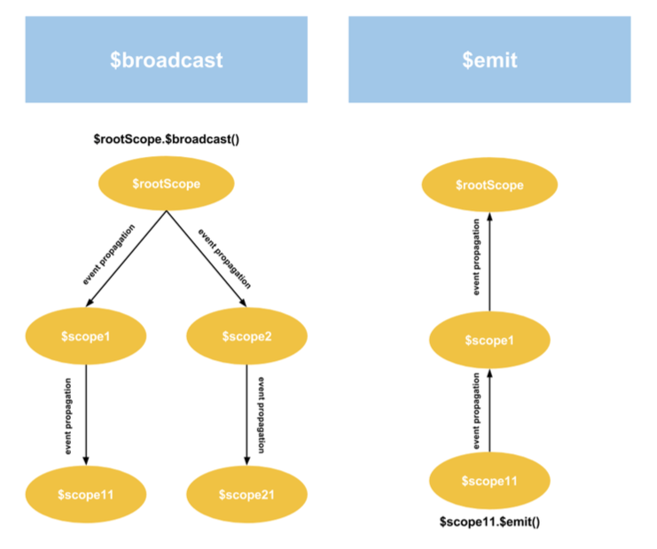

# Gestion événementielle

Deux types de propagations sont permises dans Angular :
- Emission remontant la hiérarchie des portée : `$scope.$emit(name,args)`
- Publication descendant la hiérarchie des portée : `$scope.$broadcast(name,args)`
 

Les abonnement sont effectués via `$scope.$on(name,handlerFunction)`

[events example](http://jsbin.com/vurahi/edit?html,js,output)

> **Hint** Lorsque les `controller` ne sont pas enfant, il est possible d'utiliser `$rootScope.broadcast()` à la place.

<!-- Blockquote force -->

> **Note** `$rootScope` peut être utilisé comme un _Central Message Bus_, utile dans de larges applications où les messages peuvent être partagés entr eles différents éléments.  

## Evénement `$destroy`
 
Evénement intéressant car il notifie de la suppression d'un `scope`. 

