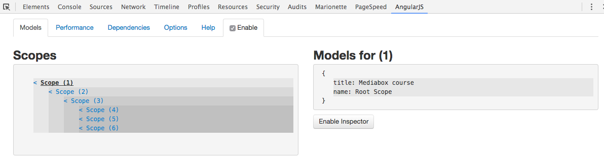

# Scope

`$scope` est la glue qui relie l'interface HTML avec le `controller`.
Il s'agit en fait d'un `object` simple de ce type :

```javascript
{name:'AngularJS', teacher:'Eric'}
```

## Imbrication des portées

Toute application angular, dès qu'elle déclare l'attribut `ng-app` définie un `$rootScope`.
Lorsque la `directive` `ng-controller` est employée, une "portée enfant" est crée, qui hérite (via un `prototype`) de `$rootScope`.

Lorsque vous imbriquez des directives `ng-controller` les unes dans les autres, vous définissez une chaine de portées, héritée.
Ainsi, toute portée enfant accèdera aux valeur de sa (ou ses) portées parentes.

## Héritage 

`$rootScope` dispose d'une méthode `$new()`.
Cette méthode crée un `scope` enfant.

[Scope inheritance](http://jsbin.com/loqofo/edit?html,js,output)

> **Tag** /demos/02-inherited_scopes

