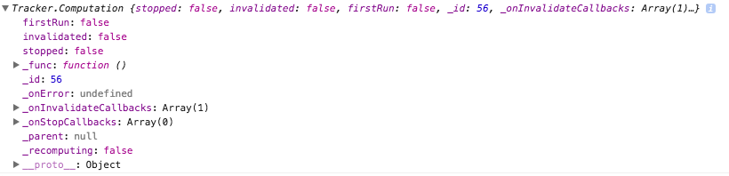

# What is this "reactivity" after all ?

## Valeurs réactives natives

- Collection
- Session
- ReactiveVar
- ReactiveDict

## Fonctionnement

Lorsqu'une valeur reactive est changée, elle notifie automatiquement chaque élément relié. Cela fonctionne comme les tableaux excel, dans lesquels une modification de cellule peut entrainer celles d'autres, automagiquement.

Mais quel est le principe sous-jacent ?
Est-ce que c'est un principe efficace ?


## Function `autorun`

```js
let reactive = new ReactiveVar( 1 );

Tracker.autorun
(
	() =>
	{
		console.log( `autorun reactive : ${reactive.get()}` );
	}
)
```

Si depuis la console, nous modifions la valeur de cette variable, nous observons que cette fonction est activée. 

```js
reactive.set(2); // autorun reactive : 2
```

> **Hint** [Pour activer l'es2015 dans la console, installez l'extension chrome ScratchJS](https://chrome.google.com/webstore/detail/scratch-js/alploljligeomonipppgaahpkenfnfkn)

Quel lien existe t-il entre ces deux valeurs ?

## `Computations`

La fonction `Tracker.autorun()` retourne une valeur, que nommée `Computation` dans la terminologie Meteor.

```js
let reactive = new ReactiveVar( 1 );

let computation = Tracker.autorun
(
	() =>
	{
		console.log( `autorun reactive : ${reactive.get()}` );
	}
);

console.log( computation ); // Tracker.Computation{} 
```



Si par exemple, vous utilisez sa méthode `stop()`, plus aucune réactivité n'est active sur la valeur.

## Valeurs réactives personnalisées ?

```js
let reactive = new Tracker.Dependency();

let computation = Tracker.autorun
(
	() =>
	{
		reactive.depend();
		console.log( `autorun reactive called` );
	}
);

reactive.changed();// autorun reactive called
```

## Terminologie

1. Les valeurs réactives sont des `Tracker.Dependency`. Elles émettent leur modification de valeur via leur méthode `changed()`
1. La fonction `Tracker.autorun()` retourne une `Tracker.Computation`. Celle-ci reçoit les messages `changed` depuis sa `Tracker.Dependency`

## Est-ce optimisé ?

### Lien entre la `Dependency` et sa `Computation`

```js
let reactive = new ReactiveVar(1);

let computation = Tracker.autorun
(
	() =>
	{
		console.log( `autorun reactive : ${reactive.get()}` );
	}
);

reactive.dep // Tracker.Dependency
reactive.dep._dependentsById // Object
/* 
{
	54 : Tracker.Computation
}
*/

reactive.dep._dependentsById[ 54 ]._func() //autorun reactive : 1 !!!

reactive.dep.changed() //autorun reactive : 1 !!!
```
Les `Dependency` référencent donc leur `Computation`.

**Dès lors, toutes les `Computation` qui se trouvent dans `dep._dependentsById`, sont systématiquement notifiées, lorsque `changed()` depuis est activé.***

### `invalidate()`

Cette méthode permet d'éviter de notifier plusieurs fois pour la même modification de valeur.

```js
computation.invalidate();// autorun reactive : 1

computation.invalidate(); computation.invalidate(); computation.invalidate(); // autorun reactive : 1
```


## Références

- [Meteor Reactivity Concepts Explained For Humans](http://www.youtube.com/oembed?url=https://www.youtube.com/watch?v=V8IU-ooJcuI&format=xml)
- [Reactivity basics](https://www.discovermeteor.com/blog/reactivity-basics-meteors-magic-demystified/)
- [Don't do, react](http://stephenwalther.com/archive/2014/12/05/dont-do-react-understanding-meteor-reactive-programming)