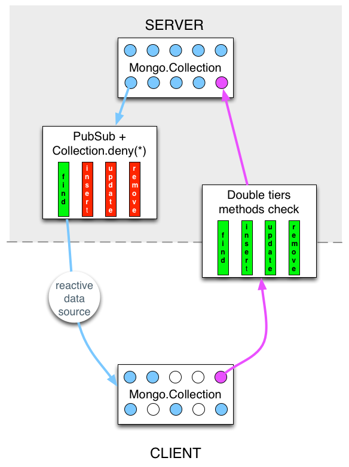
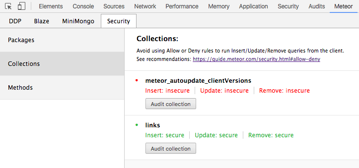

# Règles de sécurité

## Package à supprimer

Ces packages permettent de démarre rapidement une application, mais permettent à tout un chacun d'insérer du cod directement dans la base de données, depuis le client !

```sh
meteor remove autopublish
meteor remove insecure
```

## Reactivité sans pubsub

### Deny / Allow

Les collections disposent de mesure de sécurité limitant l'usage depuis le poste client aux methodes `insert`, `update` et `remove`.
[A l'usage, il s'avère qu'il est très compliqué de sécuriser une application avec ces principes](https://www.discovermeteor.com/blog/allow-deny-challenge-results/).

Ainsi, **MDG et la communauté conseillent de n'utiliser en aucun cas les méthodes de la classe `Mongo.Collection`.**

Cela veut-il dire qu'il faille éliminer la reactivité de meteor pour autant ?

Bien entendu, non !

> **Hint** Un compromis s'impose : n'utiliser collections qu'en lecture seule et passer par les `Meteor.methods()` pour administer leurs valeurs.


_See demos/03-reactive_methods_ pour un exemple complet de la méthodologie (que l'on retrouve d'ailleurs en créant son projet avec le _flag_ --full, merci MDG).



### Collections security checks

[L'extension chrome meteor devtools](https://github.com/bakery/meteor-devtools) vous  permet d'observer le niveau de sécurié de votre application, en vous mettant en valeur les failles de sécurité de votre code, en regard des bonnes pratiques.




## Sécurité des méthodes

### Valider tous les arguments

Pour cela, il est bon d'installer le package `aldeed:simple-schema` et `mdg:validated-method`. Ce dernier force la validation de tous les arguments passés en paramètres du point d'accès de votre méthode distante.

```js
import { ValidatedMethod } from 'meteor/mdg:validated-method';

export const updateText = new ValidatedMethod
({
  name: 'todos.updateText'
  ,validate: new SimpleSchema
  ({
    todoId: { type: String },
    newText: { type: String }
  }).validator()
  ,run({ todoId, newText })
  {
    const todo = Todos.findOne(todoId);
    if (!todo.editableBy(this.userId))
    {
      throw new Meteor.Error('todos.updateText.unauthorized',
        'Cannot edit todos in a private list that is not yours');
    }
    Todos.update
    (
    	todoId
    	,{
      		$set: { text: newText }
		}
	 );
	}
});
```

### Ne JAMAIS faire confiance à un userId émanant du client

### Créez une méthode par action

### Limitez l'accès trop répétitif (_flood_)

```js
// Get list of all method names on Lists
const LISTS_METHODS = _.pluck
([
  insert,
  makePublic,
  makePrivate,
  updateName,
  remove,
], 'name');

// Only allow 5 list operations per connection per second
DDPRateLimiter.addRule
({
  name(name)
  {
    return _.contains(LISTS_METHODS, name);
  },
  // Rate limit per connection ID
  connectionId() { return true; }
 }
 , 5, 1000
);
```


## Meteor security checklist

A revoir fréquemment, la [Meteor security checklist](https://guide.meteor.com/security.html#checklist).

1. Make sure your app doesn't have the `insecure` or `autopublish` packages.
1. Validate all Method and publication arguments, and include the `audit-argument-checks` to check this automatically.
1. [Deny writes to the `profile` field on user documents.](accounts.html#dont-use-profile)
1. [Use Methods instead of client-side insert/update/remove and allow/deny.](security.html#allow-deny)
1. Use specific selectors and [filter fields](http://guide.meteor.com/security.html#fields) in publications.
1. Don't use [raw HTML inclusion in Blaze](blaze.html#rendering-html) unless you really know what you are doing.
1. [Make sure secret API keys and passwords aren't in your source code.](security.html#api-keys)
1. Secure the data, not the UI - redirecting away from a client-side route does nothing for security, it's just a nice UX feature.
1. [Don't ever trust user IDs passed from the client.](http://guide.meteor.com/security.html#user-id-client) Use `this.userId` inside Methods and publications.
1. Set up [browser policy](https://atmospherejs.com/meteor/browser-policy), but know that not all browsers support it so it just provides an extra layer of security to users with modern browsers.


## References

- [Client-side operations](https://www.discovermeteor.com/blog/meteor-methods-client-side-operations/)
- [Handling publications errors](https://meteoruniversity.org/handling-publication-errors/)
- [Meteor publications and subscriptions](https://codebrahma.com/meteor-publications-and-subscriptions/)
- [Keep It Secret, Keep It Safe](http://www.east5th.co/blog/2015/05/25/keep-it-secret-keep-it-safe/)
- [https://dweldon.silvrback.com/common-mistakes](https://dweldon.silvrback.com/common-mistakes)
- [Client-Side Encryption in Meteor](https://medium.com/@PhilippSpo/client-side-encryption-in-meteor-3ae982e557a8#.svlqn2yx1)
