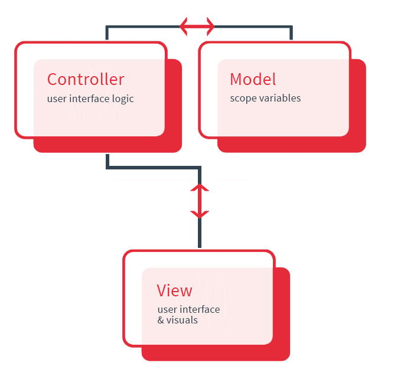

# Interface utilisateur dynamique

Meteor supporte officiellement trois _frameworks_ pour gérer l'interface. Chacun apporte une solution différente à l'affichage de données dynamiques.

React et Angular confèrent une architecture baséé sur les composants, idéale pour les grosses applications.
Toutefois, en suivant certaines conventions, Blaze peut s'avérer une bonne solution également.

## Blaze

Ce moteur de template est celui dont l'usage est le plus simple. Sa syntaxe est héritée de la librarie `Handlebars` à laquelle a été ajouté  des blocks d'opération tels que `{{#if}}` ou `{{#each}}`.

Il possède une intégration simple avec des packages _Atmosphere_ tels que `useraccount`.

## React

React utilise une syntaxe, le [JSX](https://facebook.github.io/react/docs/jsx-in-depth.html) qui nécessite une _transpilation_. Ceci est rendu possible par l'usage de Babel.

En JSX, vous écrivez du HTML au sein du code ecmascript. Bien que cela puisse sembler une aberration pour certains, cette syntaxe confère une vraie souplesse car elle permet **de déclarer toute la logique dans un seul et même fichier**. Ainsi, l'ensemble des éléments propres à une vue, restent liés.

React utilise un algorithme interne pour éviter de manipuler le DOM trop fréquemment. Celui-ci fonctionne en opérant des différences sur les portions à changer.

Plus d'infos

- [The Inner Workings Of Virtual DOM](https://medium.com/@rajaraodv/the-inner-workings-of-virtual-dom-666ee7ad47cf#.nrdrtb1qd)
- [React Virtual DOM vs Incremental DOM vs Ember’s Glimmer: Fight](https://auth0.com/blog/face-off-virtual-dom-vs-incremental-dom-vs-glimmer/)

## Angular

Angular propose des [arguments HTML complémentaires](https://angular.io/docs/js/latest/guide/cheatsheet.html) pour gérer la logique visuelle. 

Angular utilise la technique du _2-way databinding_ pour synchroniser les données avec leur affichage.

## Mobile

### Cordova

- Toutes les librairies fonctionnent bien, une fois inclus dans une webview.
- [Ionic version 2](http://ionicframework.com/docs/), qui utilise Angular version 2 est le framework le plus avancé.
- Ionic version 1, peut être utilisé depuis Angular 1, Blaze et React.

### Native

- [ React native](https://facebook.github.io/react-native/) permet l'usage du JSX pour faire appel à des composants natifs Objective-C ou Java. [Un descriptif est disponible](https://github.com/spencercarli/react-native-meteor-index)

## Conventions pour les composants

### Composants réutilisables

Ce type de composant s'efforce à être le plus autonome, c'est-à-dire indépendant de son contexte externe.

**Celui-ci n'utilise aucune donnée globale**. Toutes ses dépendances sont bien déterminées.
Notamment, il est préférable de se servir directement de :

- `Meteor.users`
- `Meteor.user()` et `Meteor.loggingIn()`
- Information de la route utilisée.

Il sera donc simple à tester.

### Composants intelligents

Ceux-ci sont intelligents lorsque **leurs données leur sont passées de façon automatique et transparente, depuis un conteneur parent**.

Ce concept provient du découplage des responsabilités d'affichage que l'on retrouve notamment avec [le concept de React de stateless components](Stateless Functional Components in React 0.14).

## Techniques communes d'affichage

- [User interface patterns](https://guide.meteor.com/ui-ux.html#ui-patterns)
- [User experience patterns](https://guide.meteor.com/ui-ux.html#ux-patterns)